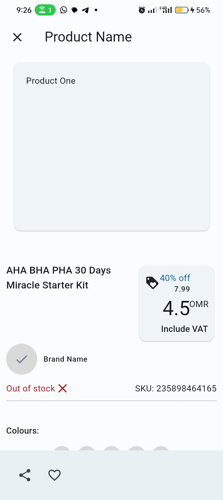
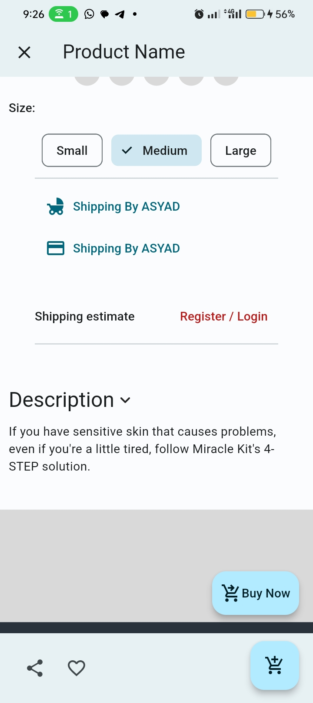
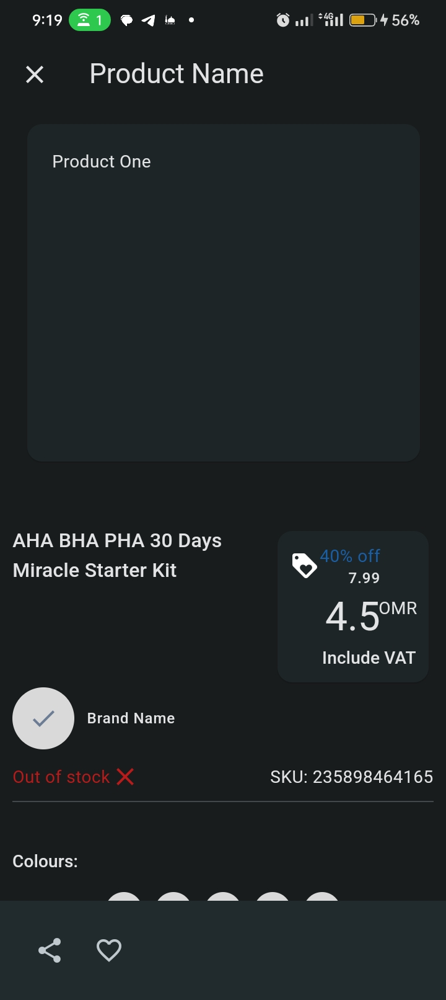
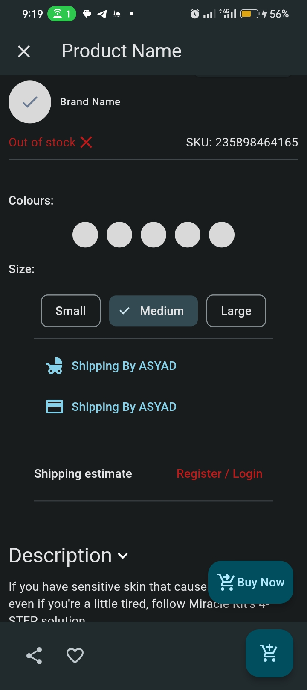

# Flutter Product Screen UI Sample

This repository serves as a sample project showcasing a sophisticated Product Screen UI developed using Flutter and Dart. The purpose of this project is to demonstrate various concepts in Flutter UI design, including dynamic theming, animations, and the creation of complex widgets.

## Features

- **Dynamic Theming:** The app includes dynamic theming to provide users with the flexibility to switch between different themes, enhancing the overall user experience.

- **Animation:** Experience smooth and visually appealing animations incorporated throughout the UI. These animations not only add a touch of elegance but also contribute to a more engaging user interface.

- **Complex Widget Creation:** Explore the implementation of complex widgets that are crucial for building intricate UI designs. Learn how to structure and organize widgets to achieve a polished and cohesive look.

- **and other concepts** 

## Screenshots
### Light Theme

<table>
  <tr>
    <td><p align="center">Screen 01</p></td>
     <td><p align="center">Screen 02</p></td>
    
  </tr>
  <tr>
    <td valign="top"></td>
    <td valign="top"></td>   
  </tr>
 </table>

### Dark Theme
<table>
  <tr>
    <td><p align="center">Screen 01</p></td>
     <td><p align="center">Screen 02</p></td>
    
  </tr>
  <tr>
    <td valign="top"></td>
    <td valign="top"></td>   
  </tr>
 </table>


## Getting Started

To run this Flutter project locally, follow these steps:

1. **Clone the Repository:**
   ```
   git clone https://github.com/mattias-nkonjo/product-screen-ui.git
   ```

2. **Install Dependencies:**
   ```
   flutter pub get
   ```

3. **Run the App:**
   ```
   flutter run
   ```

## Requirements

- Flutter SDK
- Dart SDK

## Support me

- If you like the work please give me a star

## Contact
Do you have a project or looking? we can get in touch [Mattias Nkonjo] at [mattiasthedev@gmail.com].

## License
This project is licensed under the MIT License.